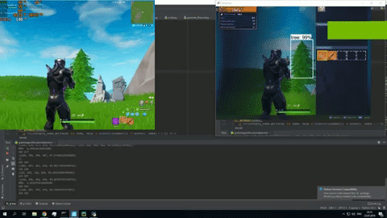

<h1 align="left">
   AiFortnite 
</h1>

## Machine learning implementation of playing battle royal game Fortnite

Custom implementation of neural network model to play Fortnite in real time. 

## Running
To run this file weights should be imported.
python grabimagewithcustomdetection.py

## Key Features
* YOLO object detection algorithm 
* Custom weights for each object from game without game engine manipulation 
* Accuracy 80%

## Example

## Built With

* [Tensorflow](https://www.tensorflow.org) - machine learning library 
* [OpenCV](https://opencv.org) - Computer vision and machine learning library 

## Authors
Arthur Zinnurov

## License
MIT
